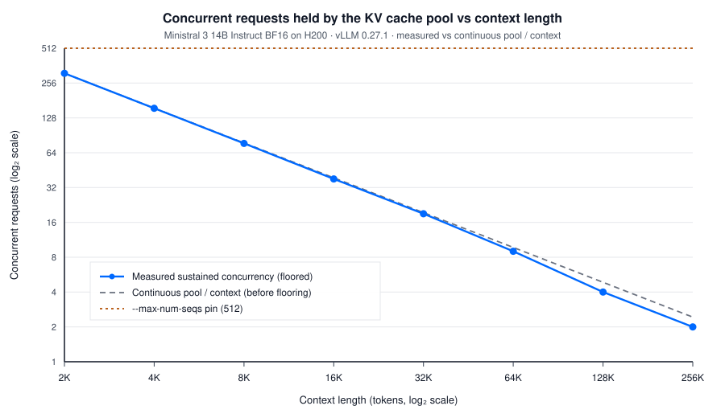
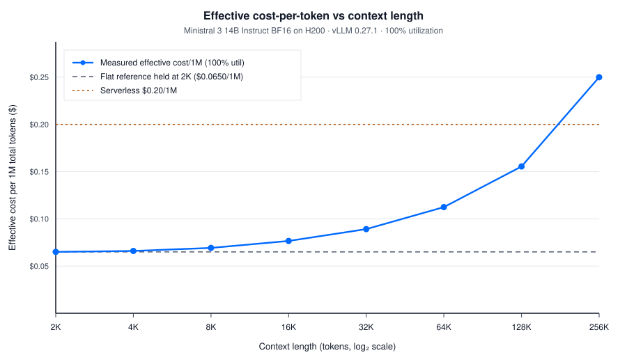

# Context Length and Inference Cost on a Dedicated H200

Raw measurements for the DigitalOcean Community article *[Does Context Length Affect Inference Cost Linearly? We Measured Why It Doesn't](https://www.digitalocean.com/community/tutorials/does-context-length-affect-inference-cost-linearly)* (forthcoming).

Ministral 3 14B Instruct, served with vLLM 0.27.1 on a single NVIDIA H200 GPU Droplet, swept across 2K, 4K, 8K, 16K, 32K, 64K, 128K, and 256K tokens of input context. The headline finding in the article is a **3.84x** rise in effective cost per million total tokens from 2K ($0.0650/1M) to 256K ($0.2500/1M) at 100% utilization, driven by KV-cache pool capacity collapsing from 311 concurrent requests to 2.

This repository is the evidence. Every throughput, latency, and concurrency figure in the article traces to `summaries/sweep_summary_v4.md` and to the `--save-detailed` JSON under `data/`.

| | |
| --- | --- |
| **Hardware** | DigitalOcean `gpu-h200x1-141gb` (one H200, 141 GB VRAM), three Droplets in parallel |
| **Engine** | vLLM 0.27.1 |
| **Checkpoint** | `mistralai/Ministral-3-14B-Instruct-2512-BF16` |
| **GPU memory util** | `--gpu-memory-utilization 0.90` |
| **Output length** | 256 tokens, fixed |
| **Prefix caching** | Disabled (`--no-enable-prefix-caching`) |
| **Trials** | 3 per point after a separate 10-request warm-up that is discarded |
| **Run date** | 26 August 2026 (v4 patch pass ~19:41–22:50 UTC; 128K/256K BF16 and the FP8 arm carried from the earlier v3 pass) |

The cost identity used in the article is `$4.47 / (total_tok_s × 3600 × util) × 1e6`, with `$4.47/hr` the H200 Droplet rate last verified 25 August 2026. Do not round those dollars independently: the 3.84x ratio is `19089.8 / 4967.2` from unrounded throughput, which equals `0.2499731572 / 0.0650434613`.

---

## Start here

1. Read `summaries/sweep_summary_v4.md`. That is the headline table. `sweep_summary.md`, `_v2`, and `_v3` are superseded and kept because the version history is how the four bugs below were found.
2. Recompute peak concurrency from the raw JSON (no GPU required):

```bash
python3 analysis/true_concurrency.py data/run-A-short-context/bench_2048_trial1.json
```

3. Rebuild the two published charts from the tabulated coordinates:

```bash
python3 analysis/plot_charts.py --out charts
```

4. To rerun the sweep, see [How to run this yourself](#how-to-run-this-yourself). You need an H200 Droplet, vLLM 0.27.1, and the BF16 checkpoint.

---

## What the raw files are for

vLLM's `max_concurrent_requests` field is a whole-second, both-endpoints-inclusive bucket count. At 2K it reported 334, 333, and 335 across the three trials while a millisecond-precision interval sweep over `start_times`, `ttfts`, and `itls` gave **311** in every trial, matching `floor` of the boot-log ceiling (311.02x). The over-report is 23 requests at that point. The article's concurrency column is the interval-sweep number. You can only reproduce that from the detailed JSON, which is why those files are the point of this repo.

`vllm:kv_cache_usage_perc` is a gauge. The scrapes in `data/*/metrics_*_trial*.log` were taken at end of trial, after load had drained, and they read **0.0** everywhere. That is an idle server, not pool occupancy under load. `vllm:num_preemptions_total` is a counter; its **0** in those same files is a real result. Pool occupancy under load is derived from reserved pool size times measured concurrency, which is how the article reports it.

Startup logs (`vllm_startup_*.log`) are the source for KV pool size and the `Maximum concurrency for N tokens per request` line. The article reads those from the log rather than deriving them.

The JSON files keep `start_times`, `ttfts`, `itls`, and the aggregate fields. `generated_texts` is present as an empty list: those strings were random completions from vLLM's `random` dataset and are not used anywhere in the article.

---

## Four bugs anyone reproducing this sweep will hit

These are the reason the published numbers come from v4, not from the first pass.

### 1. Concurrency clamp at 64

`probe_and_size` used to set concurrency to `min(boot_ceiling, 64)`. At 2K, 4K, and 8K the boot log reported 311.02x, 155.51x, and 77.76x, and the code silently overrode all three to 64. Throughput at those points was suppressed by up to 22%, and the curve showed a hump peaking at 8K that was an artifact of the clamp, not of the KV pool.

The article's methodology said `--max-concurrency` came from the boot log. The scheduler-pin safeguard was watching `--max-num-seqs` (512). Those are different knobs. The clamp was on `--max-concurrency`, so the pin could never have caught it.

**Fix:** drop the clamp. Concurrency is `floor` of the boot-log ceiling. v4 true peak matches that floor at every point: 311, 155, 77, 38, 19, 9, 4, 2.

### 2. Request-volume sizing from a 15-request probe

`num_prompts` was computed from a 15-request probe. Fifteen requests cannot fill a 311-wide batch, so the probe measured a latency-bound trickle and underestimated sustained throughput by roughly 5x. The 8K point ran 41.94 seconds against a 200-second target and completed 1.68 batch turnovers.

**Fix:** probe with a full batch (`num_prompts = concurrency`), then size the timed trial as `max(50, rate*200, concurrency*8)`. The 50-prompt floor binds at 128K and 256K. The 8x turnover floor binds everywhere shorter. The acceptance gate rejects a trial shorter than 150 seconds or with fewer than 6 turnovers.

### 3. `VLLM_ATTENTION_BACKEND` silently ignored

vLLM 0.27.1 does not honor that environment variable. The FP8 arm ran FlashAttention while the driver believed it had selected FlashInfer, and the first version of the gate looked for a log string the engine no longer prints.

**Fix:** pass `--attention-backend FLASHINFER` as a CLI flag. Refuse to count an FP8 point until the startup log contains `Using AttentionBackendEnum.FLASHINFER backend.` The C logs in this repo show that line, and `attention_backend: FLASHINFER` in the non-default-args dump.

### 4. Input-length margin of zero

`random-input-len` was `ctx - 256`, which leaves no headroom. vLLM's random-prompt generator occasionally lands one token over target because its decode-then-reencode correction is documented as best-effort. Small batches hid the overflow under a 90% completion threshold. Larger batches, after bug 2 was fixed, made a 400 from the server near-certain.

**Fix:** `INPUT_LEN_MARGIN = 8`. The argparse dump in `data/run-A-short-context/bench_stdout_2048_trial1.log` shows `random_input_len=1784` (`2048 - 256 - 8`).

---

## Acceptance gate

`validate_trial()` rejects a completed trial when any of these hold:

- any failed request
- duration below 150 seconds
- fewer than 6 batch turnovers (`completed / max_concurrency`)
- configured `max_concurrency` disagrees with `floor` of the boot-log ceiling
- observed concurrency reaches the `--max-num-seqs` pin of 512

v4 recorded zero rejections across the 18 re-run trials (2K through 64K, three trials each). 128K and 256K on the BF16 arm, and both FP8 points, were carried from v3; a later read-only pass applied the interval-sweep concurrency check to those existing JSON files and confirmed 4, 2, 9, and 4 respectively.

---

## Headline results (BF16 arm)

Copied from `summaries/sweep_summary_v4.md`. Use that file if a number here and a number there ever disagree.

| Context | Boot ceiling | True peak concurrency | Total tok/s (mean±std) |
| --- | ---: | ---: | ---: |
| 2K | 311.02x | 311 | 19089.8 ± 16.5 |
| 4K | 155.51x | 155 | 18812.3 ± 5.4 |
| 8K | 77.76x | 77 | 17933.2 ± 6.5 |
| 16K | 38.88x | 38 | 16214.8 ± 6.7 |
| 32K | 19.44x | 19 | 13929.6 ± 12.9 |
| 64K | 9.72x | 9 | 11048.2 ± 19.5 |
| 128K | 4.86x | 4 | 7988.2 ± 2.8 |
| 256K | 2.43x | 2 | 4967.2 ± 1.5 |

The sweep has no measurement between 128K and 256K. Effective cost at 100% utilization first exceeds the $0.20/1M serverless rate at 256K ($0.2500). That is the only tested point whose break-even utilization is above 100%.

FP8 KV cache (same BF16 weights, `--kv-cache-dtype fp8`, FlashInfer) at 128K and 256K held 9 and 4 concurrent requests against 4 and 2 on BF16.





---

## How to run this yourself

Provision a DigitalOcean H200 Droplet (`gpu-h200x1-141gb`), install vLLM 0.27.1 in `/root/vllm_env`, and pull `mistralai/Ministral-3-14B-Instruct-2512-BF16`. The driver SSHes in as root and writes to `/root/mktg3270_logs`.

```bash
export SSH_KEY=$HOME/.ssh/your_key
export SWEEP_LOG_ROOT=$(pwd)/data

# Headline arm, 2K through 16K (Droplet A in the original split)
python3 harness/sweep_orchestrator.py A DROPLET_A_IP 2048,4096,8192,16384 bf16 run-A-short-context

# Headline arm, 32K through 256K
python3 harness/sweep_orchestrator.py B DROPLET_B_IP 32768,65536,131072,262144 bf16 run-B-long-context

# FP8 KV sensitivity, 128K and 256K only
python3 harness/sweep_orchestrator.py C DROPLET_C_IP 131072,262144 fp8 run-C-fp8-sensitivity
```

Replace `DROPLET_*_IP` with the Droplet addresses. The original run used three machines so the long-context points could overlap with the short-context ones; a single Droplet in sequence also works, it just takes longer.

`--max-num-seqs` starts at 512. Prefix caching stays off. Output length stays 256. The FP8 arm adds `--kv-cache-dtype fp8 --attention-backend FLASHINFER` and will stop rather than record a point if FlashInfer is not confirmed in the startup log.

---

## Repository layout

```
harness/sweep_orchestrator.py   v4 driver (clamp removed, turnover floor, acceptance gate)
analysis/true_concurrency.py    interval-sweep peak from a --save-detailed JSON
analysis/plot_charts.py         rebuilds the two published SVGs from tabulated coordinates
data/run-A-short-context/       BF16, 2K-16K: JSON, startup logs, metrics, bench stdout
data/run-B-long-context/        BF16, 32K-256K
data/run-C-fp8-sensitivity/     BF16 weights + FP8 KV, 128K and 256K
logs/                           orchestrator consoles for the published trials (IPs redacted)
summaries/sweep_summary_v4.md   headline tables
summaries/sweep_summary*.md     v1-v3, marked superseded
charts/                         published concurrency-collapse (v5) and cost-curve (v4) SVGs
```

Droplet addresses in logs are replaced with `DROPLET_A`, `DROPLET_B`, and `DROPLET_C`.

---

## Citation

```
Vinayak Baranwal (2026). Context-length inference cost sweep on Ministral 3 14B.
https://github.com/vinayakbaranwal12/context-length-inference-cost
```

Or use [CITATION.cff](CITATION.cff).

## License

Apache License 2.0. See [LICENSE](LICENSE). That matches the Apache 2.0 license on `mistralai/Ministral-3-14B-Instruct-2512`.
